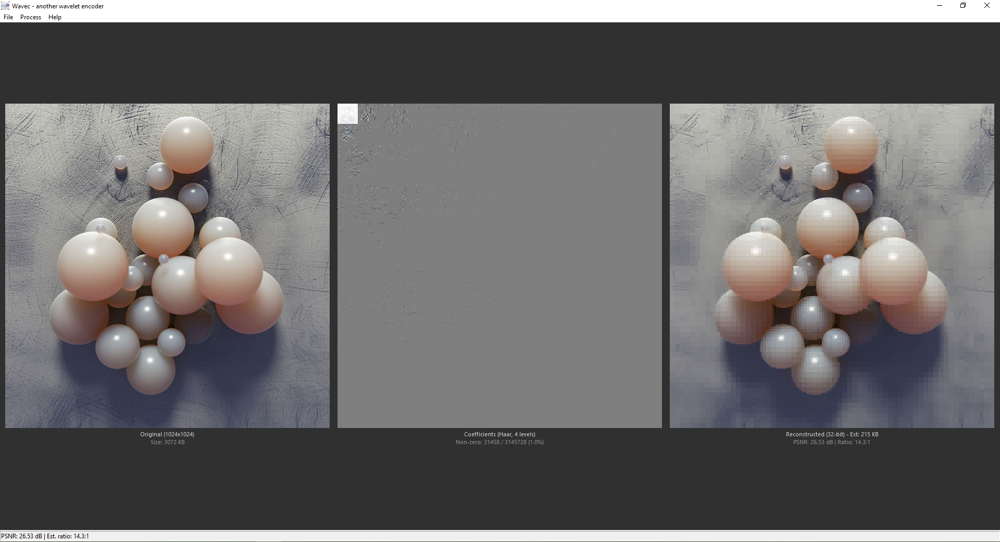

# Wavec - Wavelet Image Codec





A simple wavelet-based image compression tool built through **vibe coding** experimental, exploratory, and made for fun.

## What is this?

Wavec is a Windows desktop application that implements wavelet-based image compression. It can:

* Load 24-bit BMP images
* Apply 2D Discrete Wavelet Transform (DWT) using **Haar**, **Daubechies-4**, or **CDF 9/7** wavelets
* Discard small coefficients for compression
* Quantize remaining coefficients
* Save to a custom `.WT` sparse format
* Reconstruct images using Inverse DWT

## Important: Image Requirements

**Use BMP images with dimensions that are powers of 2** (e.g., 256×256, 512×512, 1024×1024, 512×256, etc.)

This ensures optimal wavelet decomposition across all levels. Non-power-of-2 dimensions may work but could produce unexpected results or artifacts.

## Building

### Requirements

* Windows 10/11
* Visual Studio 2022 (Community edition works fine)
* Windows SDK

### Compilation

Run the provided batch file:

```batch
compile.bat
```

Or manually:

```batch
call "C:\Program Files\Microsoft Visual Studio\2022\Community\VC\Auxiliary\Build\vcvars64.bat"
rc wavec.rc
cl wavec.cpp wavec.res user32.lib gdi32.lib comdlg32.lib comctl32.lib /Fe:wavec.exe /O2
```

## Usage

1. **Open a BMP** `File > Open BMP...` or `Ctrl+O`
2. **Transform** `Process > Transform...` or `F5`
   * Select wavelet type (Haar, Db4, CDF 9/7)
   * Choose decomposition levels (Auto recommended)
   * Set discard percentage (higher = more compression, more loss)
   * Adjust quantization bits (lower = smaller file, more artifacts)
3. **Save as WT** `File > Save WT...` to save compressed format
4. **Save as BMP** `File > Save BMP...` to export reconstructed image
5. **Reset** `F7` to restore original image

## Keyboard Shortcuts

| Key | Action |
|-----|--------|
| `F5` | Transform |
| `F7` | Reset |
| `Ctrl+O` | Open BMP |
| `Ctrl+S` | Save BMP |

## The .WT Format

A custom sparse format that stores only non-zero wavelet coefficients as `(index, quantized_value)` pairs. Includes metadata for reconstruction:

* Image dimensions
* Wavelet type and decomposition levels
* Quantization parameters
* Coefficient value range for dequantization

## Wavelets Implemented

| Wavelet | Description |
|---------|-------------|
| **Haar** | Simplest wavelet, uses averages and differences |
| **Daubechies-4** | 4-tap orthogonal wavelet with better frequency localization |
| **CDF 9/7** | Biorthogonal wavelet used in JPEG2000, implemented via lifting scheme |

## Disclaimer

This is a **vibe coding** project built experimentally without rigorous testing or production-quality standards. It's meant for learning, exploration, and having fun with wavelet transforms. Use at your own risk!

## References

* [Haar Wavelet](https://en.wikipedia.org/wiki/Haar_wavelet)
* [Daubechies Wavelets](https://en.wikipedia.org/wiki/Daubechies_wavelet)
* [CDF 9/7 Wavelet](https://en.wikipedia.org/wiki/Cohen%E2%80%93Daubechies%E2%80%93Feauvac_wavelet)
* [Lifting Scheme](https://en.wikipedia.org/wiki/Lifting_scheme)

## License

Do whatever you want with it.
